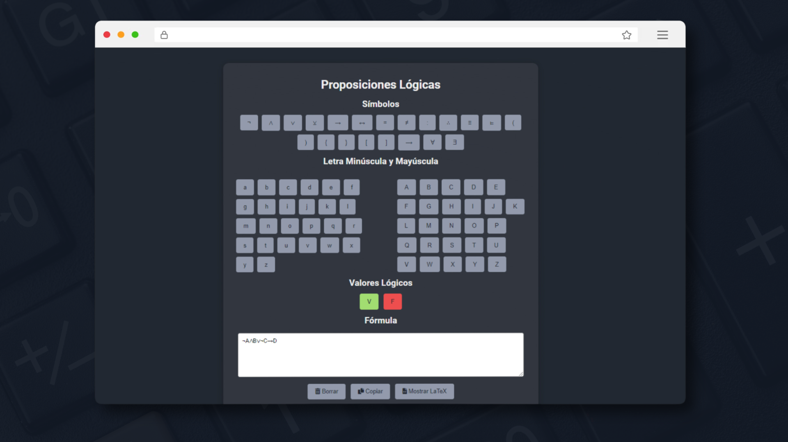

# Editor de Proposiciones Lógicas

[](#)
[](#)
[](#)
[](#)



[](#)

## Descripción del proyecto
Este proyecto es un **Editor de Proposiciones Lógicas** que integra herramientas para la manipulación interactiva de fórmulas lógicas y su conversión a formato LaTeX. Permite ingresar expresiones lógicas, insertar símbolos, letras mayúsculas y minúsculas, y utilizar botones para limpiar, copiar y visualizar la fórmula en LaTeX. Además, incluye un conversor de símbolos a LaTeX para facilitar la representación de expresiones.

## Características
- **Interfaz Interactiva**: Permite ingresar y editar fórmulas lógicas en un entorno intuitivo.
- **Inserción de Símbolos**: Ofrece botones para agregar símbolos lógicos (¬, ∧, ∨, →, ↔, etc.) y letras.
- **Conversión a LaTeX**: Convierte la fórmula ingresada en una representación LaTeX, facilitando su uso en documentos científicos.
- **Herramientas de Edición**: Funcionalidades para borrar, copiar y manipular la fórmula.
- **Diseño Responsive**: Utiliza HTML, CSS y JavaScript para un funcionamiento fluido en navegadores modernos.

## Requisitos Previos (proyecto en HTML, CSS, JAVASCRIPT)
Este proyecto requiere un navegador moderno con soporte para **HTML5**, **CSS3** y **JavaScript**. No se necesita instalar dependencias adicionales para ejecutarlo.

## Instalación
Para clonar el repositorio, utiliza el siguiente comando:

```bash
git clone https://github.com/GutBla/TOOL_Editor_Proposicion_Logica.git
```
## Uso y Ejecución (Ejecutar desde index.html)
1. Abre el archivo `index.html` en tu navegador.
2. Interactúa con la interfaz:
   - Utiliza los botones para insertar símbolos lógicos y letras.
   - Ingresa o edita la fórmula en el área de texto.
3. Emplea las herramientas disponibles:
   - **Borrar**: Limpia el contenido del campo de fórmula.
   - **Copiar**: Copia la fórmula al portapapeles.
   - **Mostrar LaTeX**: Convierte la fórmula a su representación en LaTeX y la muestra en pantalla.
4. Visualiza el resultado en el área designada para la salida de LaTeX.

## Demo en Vivo
Puedes acceder a la versión en vivo del Editor de Proposiciones Lógicas desde el siguiente enlace
[Editor de Proposiciones Lógicas - Demo](https://gutbla.github.io/TOOL_Editor_Proposicion_Logica/) o en la direccion :

```bash
git clone https://gutbla.github.io/TOOL_Editor_Proposicion_Logica/
```
